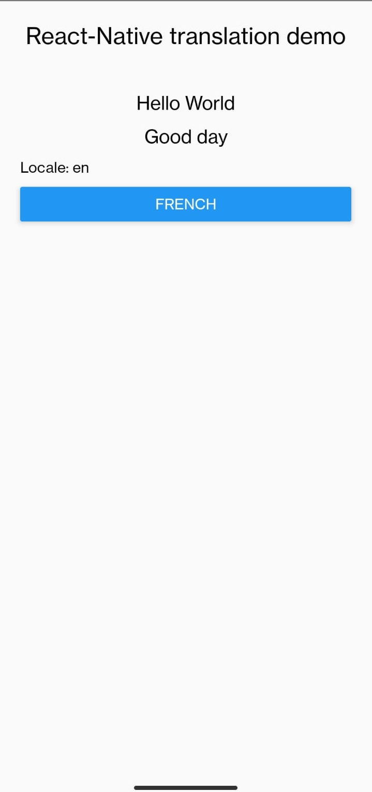
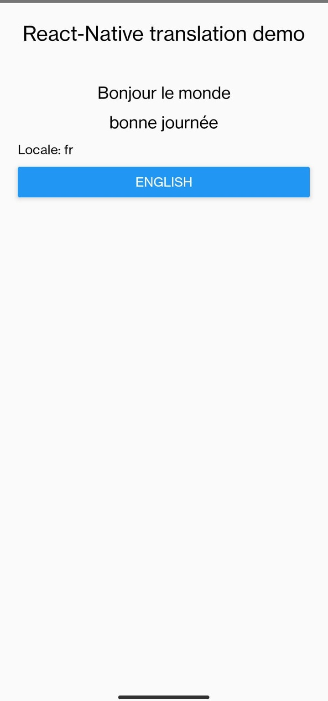

# rn translation demo

Translation example in react-native

## Requirements

* react-native >= 0.60
* i18n-js" >= 3.7.1
* react-native-localize >= 1.4
* lodash.memoize >= 4.1.2

## Get started

    $ npm i
    $ npx react-native run-android
    $ npx react-native run-ios
